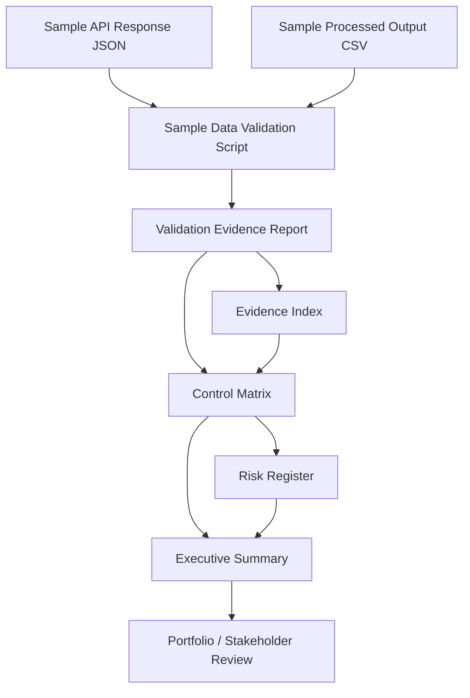

# Architecture Diagram

## Project

Cloud Data Pipeline / Secure Automation Portfolio

## Current Architecture



## Current Components

| Component | Artifact | Purpose |
|---|---|---|
| Sample API response | `data/sample_api_response.json` | Demo-safe raw input data |
| Sample processed output | `data/sample_processed_output.csv` | Demo-safe processed output |
| Validation script | `src/validate_sample_data.py` | Confirms sample files are present and structured correctly |
| Evidence report | `evidence/generated/sample_data_validation_report.md` | Captures validation results |
| Evidence index | `evidence/evidence_index.md` | Makes generated evidence findable |
| Control matrix | `security/control_matrix.csv` | Maps controls to evidence and risks |
| Risk register | `security/risk_register.csv` | Tracks risks, mitigations, evidence, and status |
| Executive summary | `docs/executive_summary.md` | Explains business, security, and governance value |

## Architecture Narrative

The current system begins with demo-safe sample data.

The validation script checks whether the expected input and output files exist and contain the expected fields. The result is written to a validation evidence report.

The evidence index makes generated evidence easier to locate.

The control matrix connects automation and evidence to control objectives.

The risk register connects those controls to specific risks and mitigations.

The executive summary translates the technical implementation into business, security, and governance language.

## Current Trust Pattern

```text
Data
  ↓
Validation
  ↓
Evidence
  ↓
Control Mapping
  ↓
Risk Mapping
  ↓
Executive Explanation
```

## Planned Future Architecture

Future versions will add:

1. Cloud storage
2. Cloud identity and access control
3. Cloud logging
4. Security evidence collection
5. Automated control checks
6. Evidence-aware AI assistant
7. Provenance and hashing
8. Crypto-agility / post-quantum readiness

## Portfolio Relevance

This diagram shows that the project is being built as a coherent secure automation system, not as disconnected scripts.

It supports the career narrative:

> Secure automation. Automate security. Prove trust.