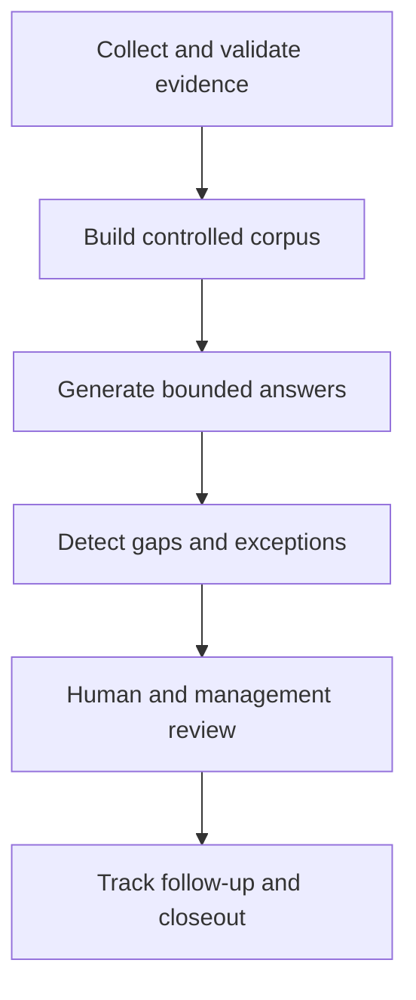

# Security Evidence Automation MVP - Portfolio Case Study

Generated: `2026-07-27T15:25:35.032229+00:00`

Portfolio Readiness: **PORTFOLIO_CASE_STUDY_READY**

## Executive Pitch

> I built a Python-based security evidence automation MVP that collects and validates evidence, constrains AI-assisted answers to available sources, identifies unsupported questions, routes gaps through human review, and tracks exceptions through management closeout.

## Problem

Security evidence is frequently scattered across technical files, control records, reports, and management decisions. AI-assisted answers can make that evidence easier to use, but they can also produce unsupported claims, obscure missing evidence, or disconnect technical findings from accountable human decisions.

## Solution

The MVP creates a governed path from evidence collection through answer generation, evaluation, gap handling, exception management, follow-up, and closeout.

## Current Generated Posture

| Measure | Current Value |
|---|---|
| Executive posture | `Red / Review Required` |
| Executive attention | `EXECUTIVE_ATTENTION_CLOSEOUT_REVIEW` |
| Evidence-system status | `REVIEW_REQUIRED_EVALUATION_FAILURES` |
| Management closeout status | `CLOSEOUT_REVIEW_REQUIRED` |

These values report the current prototype state. A review-required result means the workflow surfaced an unresolved item; it is not automatically a software failure.

## Demonstrated Capabilities

- Python automation using functions, paths, CSV processing, and Markdown generation.
- Security-data collection, transformation, validation, and cloud-storage patterns.
- Integrity, provenance, evidence manifests, and traceability.
- Evidence-bounded retrieval and source-backed answers.
- Evaluation, gap registration, remediation, and adjudication.
- Exception ownership, management decisions, follow-up, and closeout.
- Executive reporting connecting technical conditions to management attention.

## Artifact Evidence

| Artifact | Status |
|---|---|
| `docs/cloud/security_evidence_control_narrative.md` | Present |
| `docs/cloud/security_evidence_executive_summary.md` | Present |
| `docs/cloud/security_evidence_status_dashboard.md` | Present |
| `docs/cloud/security_evidence_management_closeout_summary.md` | Present |
| `ai/security_evidence_corpus_manifest.csv` | Present |
| `ai/security_evidence_executive_summary.csv` | Present |
| `ai/security_evidence_traceability_matrix.csv` | Present |
| `ai/security_evidence_traceability_exceptions.csv` | Present |
| `ai/security_evidence_decision_followup_tracker.csv` | Present |
| `ai/security_evidence_management_closeout_summary.csv` | Present |

## Control Philosophy

> No approved evidence, no confident answer.

The system does not assume retrieval results are trustworthy. It treats them as evidence candidates, evaluates whether answers remain supported, preserves gaps, and requires human or management action before closeout.

## Business Value

- Reduces manual evidence-chasing and fragmented reporting.
- Makes unsupported AI-assisted claims visible.
- Preserves ownership and decision history.
- Gives technical reviewers and executives different views of the same workflow.
- Demonstrates how security requirements can become executable, reviewable controls.

## Known Limitations

- The prototype is local and file-based.
- Retrieval uses simplified scoring rather than production semantic search.
- Reviewer and management records represent a demonstration workflow.
- The project does not provide production access control, monitoring, scaling, or deployment hardening.
- Evidence quality depends on the source artifacts.

## Five-Minute Demonstration

1. Show the executive summary and current attention status.
2. Show the control narrative and evidence-boundary rule.
3. Trace one question from retrieval through evaluation.
4. Trace one exception through decision and closeout.
5. End with the artifact map and known limitations.

## Resume-Ready Statement

> Designed and built a Python-based security evidence automation MVP integrating evidence ingestion, validation, provenance, bounded retrieval, answer evaluation, human adjudication, exception management, and executive reporting.

## Interview Takeaway

> The project does not ask AI to be trustworthy by default. It builds a workflow that makes AI-assisted security claims bounded, traceable, reviewable, and management-owned.
